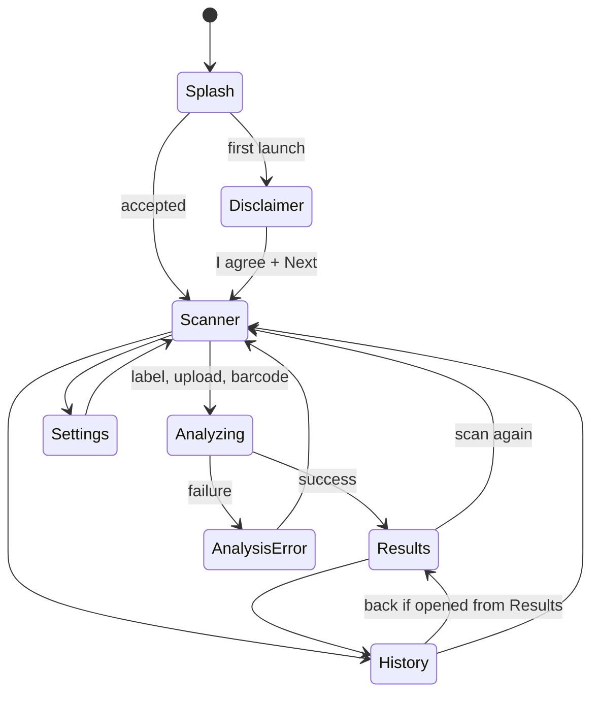
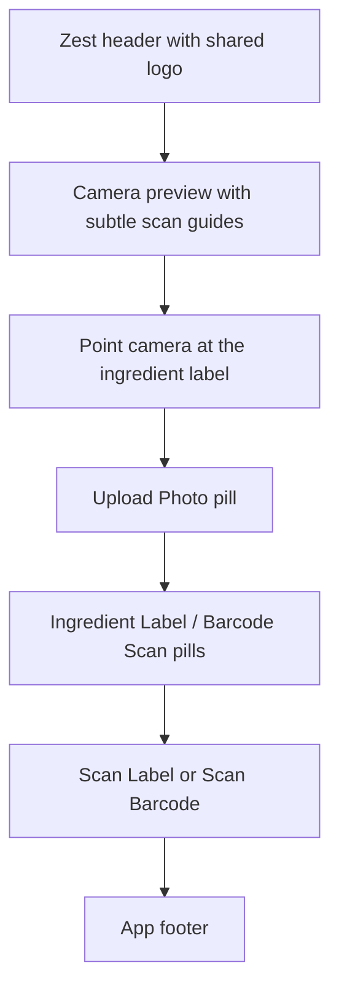
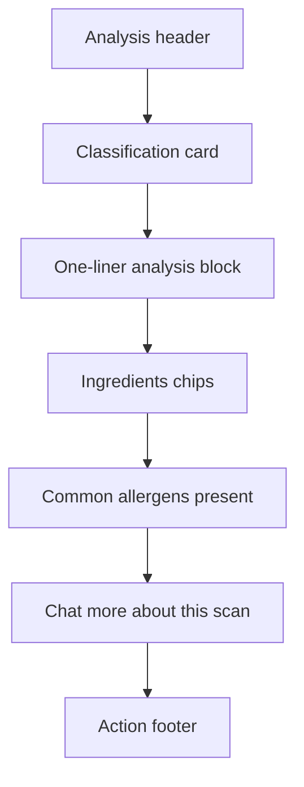

# UI And Navigation

The UI is implemented with Jetpack Compose and a small internal destination enum instead of a navigation framework. This keeps the current app shell simple while the product has a linear scanner-oriented flow.
Android system back and left-edge swipe gestures are handled by `BackHandler` in `UltraProcessedApp.kt`, so a back gesture routes within the app instead of closing the Activity from most screens.

The UI design system is shared across screens:

- App name: `Zest`
- App subtitle: `Healthier Picks`
- Fonts: Inter and Space Grotesk from `res/font`
- Type scale: centralized in `UiTextSizes.kt`
- Spacing: 8pt grid
- Brand mark: shared through `AppBrand.kt`
- Primary action color: Zest green from the app theme

## Main Files

- `ui/MainActivity.kt` - Android entry point.
- `ui/UltraProcessedApp.kt` - app shell, destination state, history persistence wiring, key presence state.
- `ui/SplashScreen.kt` - branded Compose loading screen shown on cold start.
- `ui/ScannerScreen.kt` - camera, barcode, and gallery upload entry points.
- `ui/AnalyzingScreen.kt` - launches analysis and renders progress.
- `ui/ResultsScreen.kt` - displays classification outcome.
- `ui/SettingsScreen.kt` - encrypted API key entry and model selection.
- `ui/HistoryScreen.kt` - local scan history.
- `ui/AppBrand.kt` - shared Zest logo and app title composition.
- `ui/UiTextSizes.kt` - app-wide text scale.

## Destination Model

## Back Gesture Contract

Current behavior in `UltraProcessedApp.kt`:

- `Scanner`: consumes system back as a no-op so accidental left-edge swipes do not close the app.
- `Settings`: returns to the previous app page when available, otherwise Scanner.
- `History`: returns to Results when opened from Results, otherwise Scanner.
- `Results`: returns to Scanner.
- `AnalysisError`: clears the error message and returns to Scanner.
- `Analyzing`: returns to Scanner.
- `Splash`: does not intercept back.
- `Disclaimer`: blocks first-run progress until `I agree` is checked and `Next` is tapped. When opened from Settings after acceptance, back returns to Settings.

Implementation note: the app tracks `destination` and `previousDestination`. This is intentionally lightweight and should be replaced by a centralized navigation stack in v2. See [09-todo-roadmap.md](09-todo-roadmap.md).

## State Ownership

`UltraProcessedApp` owns:

- Current destination.
- Last captured image path.
- Current barcode value.
- Current analysis mode.
- Current analysis result.
- Encrypted key presence flags.
- Local sound preference state.
- Room-backed scan history.
- Result-scoped chat workflow.

`ScannerScreen` owns short-lived camera UI state:

- Permission state.
- Camera readiness state.
- Barcode scanner readiness state.
- Selected scan mode: ingredient label or barcode.
- Capture/import in-flight state.
- Local status messages.

`SettingsScreen` owns only temporary text input state. Saved secrets are never loaded back into the text field.

## UI Security Rules

- Do not pass saved API key strings through Compose state.
- Do not use `rememberSaveable` for secret values.
- Show only key presence: "Key stored" or "No key stored".
- Clear typed key input after save/delete.

## Scanner Screen Contract

The primary button text is mode-aware. Ingredient mode shows `Scan Label`; barcode mode shows `Scan Barcode`.

## Result Screen Contract

## Screen Ownership Summary

- `ResultsScreen` owns layout and display only.
- `UltraProcessedApp` owns result-scoped chat wiring and history persistence.
- `AnalyzingScreen` owns progress and retry-status messaging.
- `SettingsScreen` owns API key validation and metadata display.
- `DisclaimerScreen` owns the exact legal/user-responsibility copy and the `I agree` gate.
- `HistoryScreen` owns the history list presentation, usage summary strip, empty state, and clear-all action.
- `SplashScreen` owns the branded loading animation only; it does not initialize network clients.

## Test Mode

`enableLiveCamera = false` is used by tests so Compose UI can be exercised without camera hardware. This is a test harness path, not a production scanner path.
