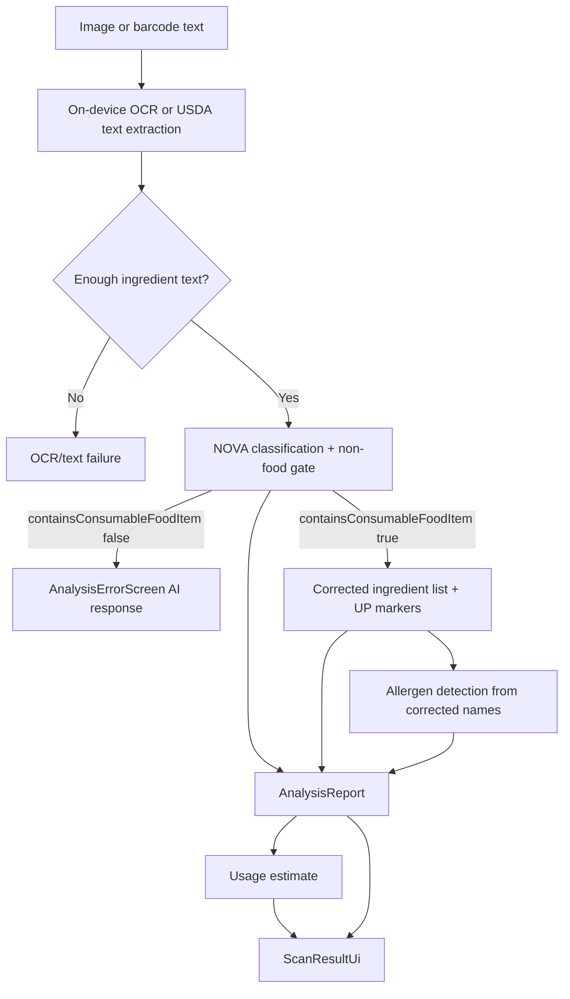
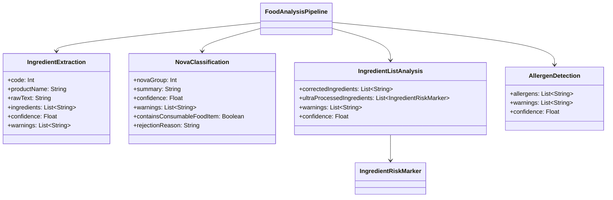
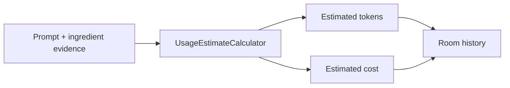

# Classification And Analysis

This layer turns on-device OCR or USDA ingredient evidence into the final result model shown by the UI. It is staged, contract-driven, and API-only for NOVA classification, ingredient cleanup, ultra-processed marker detection, and allergen detection. Images never enter the API workflow.

## Files

- `analysis/FoodAnalysisPipeline.kt`
- `analysis/AnalysisReport.kt`
- `analysis/AnalysisStage.kt`
- `analysis/UsageEstimateCalculator.kt`
- `network/llm/FoodLabelLlmWorkflow.kt`
- `network/llm/GeminiFoodLabelLlmWorkflow.kt`
- `network/llm/OpenAiCompatibleFoodLabelLlmWorkflow.kt`
- `network/llm/LlmContractRetry.kt`
- `network/llm/ResultChatWorkflow.kt`
- `assets/prompts/food_label_classification_prompt.md`
- `assets/prompts/food_label_ingredient_analysis_prompt.md`
- `assets/prompts/food_label_allergen_prompt.md`
- `assets/prompts/food_label_result_chat_prompt.md`
- `ui/ClassificationUiMapper.kt`

## Pipeline Overview



## Stage Contracts

### OCR/Text Extraction

- Input: image path or USDA ingredient text.
- Output: `IngredientExtraction`.
- Purpose: produce text evidence without sending images to the API.
- Failure: missing or too-short text stops the pipeline before classification.

### NOVA Classification

- Input: `IngredientExtraction`.
- Output: `NovaClassification`.
- Purpose: classify the whole label by NOVA group and reject non-food/non-ingredient scans.
- No image access.
- No brand or marketing inference.
- No allergen logic.

If `containsConsumableFoodItem` is false, the pipeline stops immediately and shows `rejectionReason` on the error screen.

### Ingredient List Analysis

- Input: `IngredientExtraction`.
- Output: `IngredientListAnalysis`.
- Purpose: correct ingredient names and return the subset of corrected names that are ultra-processed or industrial formulation markers.
- No overall NOVA classification.
- No allergen logic.

This stage directly controls ingredient capsule coloration:

- corrected ingredient in `ultraProcessedIngredients` -> red capsule,
- corrected ingredient not in `ultraProcessedIngredients` -> green capsule.

### Allergen Detection

- Input: corrected ingredient names from `IngredientListAnalysis`.
- Output: `AllergenDetection`.
- Purpose: identify common US / Western allergen signals from cleaned ingredient names.
- Separate UI surface from ingredient NOVA bubbles.

## JSON Outputs

### Extraction

```json
{
  "code": 0,
  "productName": "Scanned food label",
  "rawIngredientText": "Ingredients: sugar, wheat flour, milk",
  "ingredients": ["Sugar", "Wheat Flour", "Milk"],
  "confidence": 0.91,
  "warnings": []
}
```

### Classification

```json
{
  "containsConsumableFoodItem": true,
  "novaGroup": 4,
  "summary": "The list contains industrial formulation markers.",
  "rejectionReason": "",
  "confidence": 0.84,
  "warnings": []
}
```

### Non-Food Classification Response

```json
{
  "containsConsumableFoodItem": false,
  "novaGroup": 0,
  "summary": "Text doesn't contain any consumable food item.",
  "rejectionReason": "Text doesn't contain any consumable food item.",
  "confidence": 0.0,
  "warnings": ["No food ingredient evidence was found in the supplied text."]
}
```

### Ingredient List Analysis

```json
{
  "correctedIngredients": ["Sugar", "Wheat Flour", "Artificial Flavor"],
  "ultraProcessedIngredients": [
    { "name": "Artificial Flavor", "reason": "Industrial flavor marker." }
  ],
  "confidence": 0.84,
  "warnings": []
}
```

### Allergen Detection

```json
{
  "allergens": ["Milk", "Wheat"],
  "warnings": [],
  "confidence": 0.87
}
```

## Ingredient Capsule Contract

- Each `correctedIngredients` entry must be atomic and short.
- Do not return comma blobs or sentence-like strings.
- Keep ingredient order stable.
- The UI renders each ingredient as a compact chip.
- Names returned in `ultraProcessedIngredients` render red.
- Corrected names not returned in `ultraProcessedIngredients` render green.
- NOVA 1/2/3/4 colors are only for the overall classification tile, not ingredient capsule coloring.

## Contract Enforcement



## Retry Model

- Timeout retries are handled by `FoodAnalysisPipeline.runLlmStage`.
- `LLM_TIMEOUT_RETRY_ATTEMPTS` is currently 2.
- Contract/schema retry is intentionally minimal; `LlmContractRetry.kt` currently allows one contract attempt.
- If a stage returns malformed JSON, missing required fields, or an unsupported value, the pipeline fails that scan rather than inventing a rule-based fallback.

For the full API request/response contract, see [08-llm-api-contracts.md](08-llm-api-contracts.md).

## Result Mapping

`ClassificationUiMapper` converts analysis output into `ScanResultUi`:

- `novaGroup` becomes the top-level classification card.
- `correctedIngredients` becomes the ingredient chip list.
- `ultraProcessedIngredients` becomes `problemIngredients` and marks matching chips as red.
- `allergens` becomes a separate allergen block.
- `UsageEstimateCalculator` maps provider-reported input tokens, output tokens, total tokens, and cost for history summaries when available, and estimates only when provider usage metadata is absent.

## Usage And Cost Metadata

History displays provider-reported usage values when the model API includes usage metadata. If a provider omits usage metadata, the app falls back to a local estimate so history still has useful cost visibility.



## Operational Notes

- OCR text may be noisy; the prompt and parser treat it as evidence, not truth.
- If OCR cannot read enough text, the entire flow stops before any LLM request.
- If the first LLM stage says the text is not a consumable food item, later LLM stages are skipped and the user sees the returned reason.
- If NOVA classification, ingredient cleanup, or allergen detection fails, the analysis fails for that scan.
- There is no rule-based fallback classifier in the runtime path.
