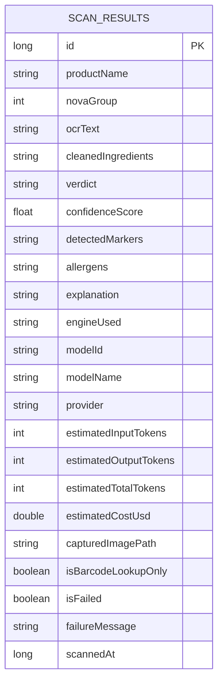
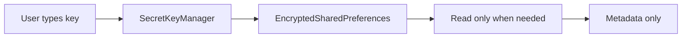

# Storage And Security

Zest keeps user data local unless the user opts into an external lookup or model provider.

The storage contract is intentionally split by sensitivity:

- secrets live in encrypted preferences,
- scan history lives in Room,
- non-secret preferences live in app SharedPreferences,
- captured images remain local files until deleted,
- provider keys are never shown back in plain text.

## Files

- `storage/secrets/SecretKeyManager.kt`
- `storage/room/NovaDatabase.kt`
- `storage/room/ScanResult.kt`
- `storage/room/ScanResultDao.kt`
- `storage/preferences/AppPreferences.kt`
- `ui/UltraProcessedApp.kt`
- `ui/SettingsScreen.kt`

## Secrets

API keys are stored with Android Keystore-backed encrypted preferences:

- `LLM_API_KEY` for text-only NOVA classification, ingredient cleanup, allergen detection, and result chat.
- `USDA_API_KEY` for FoodData Central barcode lookup.

Rules:

- Never compile API keys into the app.
- Never place API keys in `BuildConfig`.
- Never preload saved keys into Compose state.
- Save/delete methods return commit success.
- UI stores only boolean key presence.

## Non-Secret Preferences

`AppPreferences` stores local app settings that are not secrets.

Current preferences:

- Sound effects enabled or disabled.
- Disclaimer accepted or not accepted.

This data is safe to keep in normal app preferences because it does not contain credentials, health data, or scan content.

## Room History

Room persists scan results in `scan_results`.

Stored fields include:

- Product name
- NOVA group
- OCR/ingredient text
- Raw extracted ingredient text
- Verdict
- Confidence
- Detected markers
- Allergen signals
- Explanation
- Engine used
- Captured image path
- Barcode-only flag
- Timestamp
- Usage estimate fields for tokens and cost
- Failure flag and failure message for scans that reached analysis but did not produce a valid result

## Migration Policy

The database is versioned and exports schemas under `app/schemas`. The current Room version is 5.

- Version 2 adds product and UI history fields.
- Version 3 adds allergen storage.
- Version 4 adds model/provider usage estimate fields.
- Version 5 adds failed-scan history support with `isFailed` and `failureMessage`.

Migrations preserve existing rows with safe defaults and are covered by instrumentation migration coverage.

## Data Boundaries

Local:

- Label captures
- Imported images
- OCR output
- Normalized ingredients
- Classification result
- Allergen result
- History rows
- API keys
- Sound preference state
- App sounds bundled under `res/raw`

Network:

- USDA barcode lookup sends barcode/product query and uses a user-provided USDA key.
- USDA requests do not use disk HTTP cache because the API key is part of the provider request URL.
- Captured and uploaded label images are never sent to LLM providers.
- ML Kit OCR extracts text on device.
- LLM NOVA classification, ingredient cleanup, and allergen detection send extracted text/corrected ingredient JSON only, not the image.
- OCR failures stop the flow before LLM classification or allergen detection.
- Failed scans can still be persisted when a local image path exists, so History can show the failure and allow a rerun from that image.
- If no LLM key is saved, the app cannot perform analysis. All classification is dependent on the LLM provider.

## Secret Lifecycle

## Key Metadata Display

The settings screen only shows metadata inferred from the saved LLM key:

- provider
- default model name
- whether the provider is used text-only in Zest

It does not display the key itself. USDA access is also stored through `SecretKeyManager` and treated as sensitive.

## History Usage Fields

History rows include token and cost fields. Provider workflows persist exact provider-reported usage when the API response includes it; local estimates are used only when the provider omits usage metadata.
