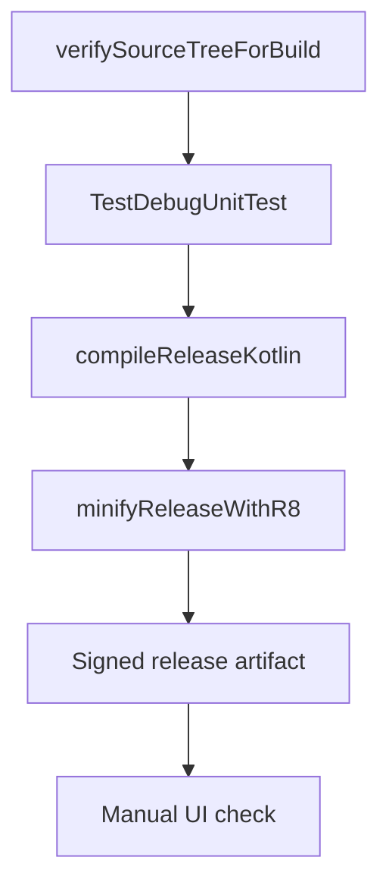

# Testing And Release

This document describes how to verify the app after changing architecture, security, networking, or UI flow.

The release bar is:

- no rule-based classification path in runtime,
- no demo/sample UI paths in production,
- no retired or macOS dataless source files entering KSP,
- API contracts enforced by tests,
- release minification passing,
- and user-facing 429 handling present in the UI.

## Fast Local Verification

Run this after most code changes:

```bash
./gradlew :app:verifySourceTreeForBuild :app:compileDebugKotlin
```

`verifySourceTreeForBuild` runs before Android `preBuild` and blocks two known release risks:

- retired demo, sample, or rule-based classifier files reappearing,
- macOS dataless placeholders under `app/src` that can make Gradle or KSP appear stuck.
- missing module version entries or stale module version documentation.

## Unit Tests

Run:

```bash
./gradlew :app:testDebugUnitTest
```

Covered areas:

- Ingredient normalization.
- USDA JSON parsing.
- USDA repository UPC matching and cache behavior.
- Food analysis pipeline proxy API workflow and invalid-image handling.
- Prompt contract parsing for NOVA classification, ingredient analysis, allergen detection, validation prompt presence, and result chat.

## Android Tests

Run from Android Studio or a connected emulator:

```bash
./gradlew :app:connectedDebugAndroidTest
```

Covered areas:

- Shared chrome rendering.
- Scanner header actions.
- Scanner startup without camera hardware in test mode.
- Session-only cleanup and no-persistence behavior.

## Release Build

Run:

```bash
./gradlew :app:assembleRelease
```

Release hardening:

- R8 minification enabled.
- Resource shrinking enabled.
- Optimized default Android ProGuard rules.
- Release lint vital checks.
- No API keys compiled into `BuildConfig`.
- Release versioning reads `ZEST_VERSION_CODE` and `ZEST_VERSION_NAME` Gradle properties.
- Release signing is mandatory for release artifacts and reads `ZEST_RELEASE_STORE_FILE`, `ZEST_RELEASE_STORE_PASSWORD`, `ZEST_RELEASE_KEY_ALIAS`, and `ZEST_RELEASE_KEY_PASSWORD` from the environment.
- `verifySourceTreeForBuild` must pass before release work begins.
- `minifyReleaseWithR8` must succeed.
- 429 and quota failures surface a specific analysis error panel with user guidance.

## Release Contract



## Verification Checklist

- Unit tests pass.
- `verifySourceTreeForBuild` passes.
- Root `module_versions.json` contains every Gradle module, top-level Android package module, backend service, backend prompt contract, documentation module, and agent-context module.
- Root `VERSION_LOG.md` contains the current release entry and the module versions changed by the release.
- Release APK assembles with signing environment variables present.
- Android test APK assembles.
- `rg "BuildConfig|local.properties|USDA_API_KEY" app/src/main app/build.gradle.kts` shows no embedded key source.
- The archived Room migration test is outside the active Android source tree.
- Settings does not expose AI model key entry.
- Image analysis and result chat call the Zest backend proxy without user AI keys.
- Release builds do not enable analysis diagnostics unless `ZEST_ANALYSIS_DIAGNOSTICS_ENABLED=true` is explicitly set.
- Backend 5xx responses and Android proxy errors do not expose provider exception details.
- Proxy analysis timeout budgets are aligned with the backend single-call Gemini analysis path.
- Live backend benchmark output records success rate, p50, p95, p99, and error counts before claiming p95 latency.
- Public backend deployment with `--allow-unauthenticated` is documented as a temporary risk; broad production launch requires an abuse-control layer.
- Backend-owned prompt assets exist for full analysis and result chat; Android does not send prompt text or schemas.
- Barcode lookup fails gracefully without a USDA key.
- Scan results and failed analyses remain only in the active session.
- Capture/import files are deleted after analysis and after relaunch cleanup.
- System back and left-edge swipe stay inside the app from Scanner, Settings, Results, Analyzing, and AnalysisError.
- Result page shows compact ingredient bubbles without rule-based sublabels.
- Non-food/non-ingredient scans show the API's readable reason inside the Analysis Error screen's `AI response` container.
- Analysis and results screens use the shared type scale, spacing, and Zest color scheme.
- Native launcher icon and splash resources use the shared Zest mark.
- Compose splash appears on cold start before the scanner home screen.
- Barcode mode changes the primary action text to `Scan Barcode`.
- Settings and Results use the same header scale and spacing.
