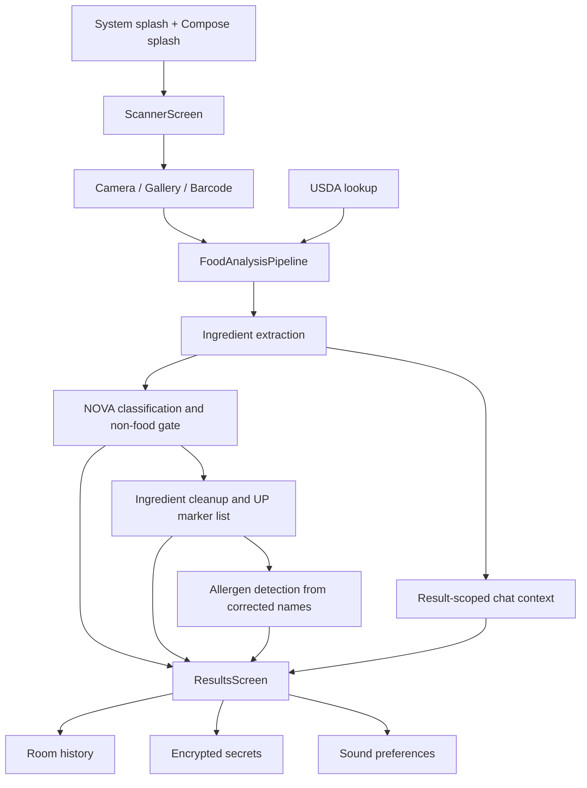

# Technical Documentation

This folder is the handoff surface for Zest. Each document explains one production area with concrete contracts, data flow, and implementation boundaries so a new engineer can work without reading the whole codebase first.

If you are not an Android developer, start with [00-android-app-guide.md](00-android-app-guide.md). It explains the project with diagrams, file maps, and plain-language Android concepts.

## Document Map

- [00-android-app-guide.md](00-android-app-guide.md) - visual non-Android guide to how this Android app works and where to make changes.
- [01-architecture.md](01-architecture.md) - system shape, runtime layers, and cross-cutting constraints.
- [02-ui-navigation.md](02-ui-navigation.md) - Compose shell, destination ownership, and screen responsibilities.
- [03-camera-ocr-barcode.md](03-camera-ocr-barcode.md) - capture, gallery import, OCR, and barcode routing.
- [04-classification-analysis.md](04-classification-analysis.md) - extraction, API-only NOVA classification, ingredient cleanup, allergen detection, and result contracts.
- [05-usda-networking.md](05-usda-networking.md) - USDA lookup, retries, cache behavior, and failure modes.
- [06-storage-security.md](06-storage-security.md) - encrypted secrets, Room history, image retention, and privacy boundaries.
- [07-testing-release.md](07-testing-release.md) - debug tests, release verification, and hardening checklist.
- [08-llm-api-contracts.md](08-llm-api-contracts.md) - exact LLM request flow, response classes, deterministic parameters, and retry semantics.
- [09-todo-roadmap.md](09-todo-roadmap.md) - engineering and product backlog, including centralized navigation stack work for v2.

## Current Product Contract




## Core Output Blocks

### Extraction

```json
{
  "code": 0,
  "productName": "Scanned food label",
  "rawIngredientText": "Ingredients: sugar, wheat flour, milk",
  "ingredients": ["Sugar", "Wheat Flour", "Milk"],
  "confidence": 0.91,
  "warnings": []
}
```

### Classification

```json
{
  "containsConsumableFoodItem": true,
  "novaGroup": 4,
  "summary": "The ingredient list contains strong ultra-processing markers.",
  "rejectionReason": "",
  "confidence": 0.82,
  "warnings": []
}
```

### Ingredient Cleanup And Capsule Coloration

```json
{
  "correctedIngredients": ["Sugar", "Wheat Flour", "Artificial Flavor"],
  "ultraProcessedIngredients": [
    { "name": "Artificial Flavor", "reason": "Industrial flavor marker." }
  ],
  "confidence": 0.84,
  "warnings": []
}
```

### Allergen Detection

```json
{
  "allergens": ["Milk", "Wheat"],
  "warnings": [],
  "confidence": 0.88
}
```

## Shared Rules

- The pipeline is API-only for NOVA classification, ingredient cleanup, ultra-processed marker detection, allergen detection, and result chat.
- Local OCR provides text input only. Captured and uploaded images never go to an LLM provider.
- The first LLM stage can return `containsConsumableFoodItem = false`; if so, the pipeline stops and the error page shows the API's readable reason in an `AI response` container.
- Ingredient bubbles are driven by corrected ingredient names. Names present in `ultraProcessedIngredients` render as red; all other corrected ingredients render as green.
- Allergens have a separate UI block and a separate API contract based on corrected ingredient names.
- OCR failures stop before any LLM request is made.
- Typography, spacing, and brand usage should come from shared UI files rather than one-off screen overrides.
- Usage totals in history use exact provider metadata when available, with local estimates only as a fallback.

## Reading Order For A New Engineer

1. Read [00-android-app-guide.md](00-android-app-guide.md).
2. Read [01-architecture.md](01-architecture.md).
3. Read [02-ui-navigation.md](02-ui-navigation.md).
4. Read [04-classification-analysis.md](04-classification-analysis.md).
5. Read [06-storage-security.md](06-storage-security.md).
6. Read [07-testing-release.md](07-testing-release.md).
7. Read [09-todo-roadmap.md](09-todo-roadmap.md) before planning v2 work.

## What To Avoid

- Do not add rule-based NOVA fallback paths back into the runtime.
- Do not put secret values in `BuildConfig`, Compose state, or repo text files.
- Do not merge allergens into ingredient coloring.
- Do not return long clause-like items in ingredient arrays.
- Do not bypass `verifySourceTreeForBuild`; it protects release builds and KSP from known bad source states.
